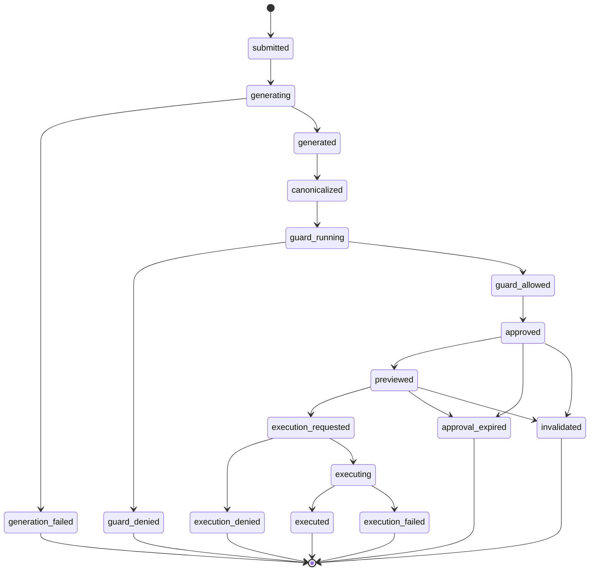

# Query Lifecycle State Machine

## Purpose

This document defines the lifecycle of a SafeQuery query candidate from natural language submission through approval, execution, and terminal outcomes.

## Why this document exists

The project requires preview-before-execute semantics that are stronger than UI convention. The lifecycle must guarantee that execution is bound to a server-owned approved candidate and not to raw SQL text submitted later by the client.

## Core Entities

### Query request

Represents the user-submitted natural language request and request-scoped metadata.

### Query candidate

Represents a generated SQL candidate stored by the backend and identified by `query_candidate_id`.

The candidate stores:

- opaque and unguessable candidate ID material
- canonical SQL
- SQL hash
- owner subject
- authorization snapshot
- guard status
- guard version
- schema snapshot version
- adapter version
- candidate creation timestamp
- approval timestamp if approved
- approval expiration timestamp if approved
- execution count
- max execution count
- invalidated timestamp if invalidated
- invalidation reason if invalidated

Canonicalization and any required row-bounding rewrite happen before guard evaluation. The canonical SQL produced there is the SQL referenced by guard evaluation, SQL hash, preview, and execute-time behavior.

## State Machine

## Transition Rules

- `submitted -> generating`: created after an authenticated request is accepted
- `generating -> generated`: entered when a candidate SQL response is returned by the adapter
- `generated -> canonicalized`: entered when the backend canonicalizes candidate SQL and applies any required row-bounding rewrite
- `canonicalized -> guard_running`: entered when application-owned SQL Guard begins validation over the canonical SQL
- `guard_running -> guard_denied`: entered when the guard rejects the candidate
- `guard_running -> guard_allowed`: entered when the guard approves the candidate for execution eligibility
- `guard_allowed -> approved`: entered when the backend persists the candidate, approval timestamp, and approval expiration timestamp
- `approved -> previewed`: entered when the already approved candidate becomes visible to the user
- `previewed -> execution_requested`: entered when the user explicitly asks to execute the previewed candidate; this is the user-visible confirmation step, not the moment approval metadata is created
- `approved -> approval_expired`: entered when the candidate TTL elapses before it is previewed
- `approved -> invalidated`: entered when policy, schema, guard, role, or kill-switch changes make the approval stale before preview
- `previewed -> approval_expired`: entered when the already approved candidate TTL elapses after preview and before execution begins
- `previewed -> invalidated`: entered when policy, schema, guard, role, or kill-switch changes make the previously approved preview stale
- `execution_requested -> executing`: entered when the backend confirms the candidate is still approved, unexpired, non-invalidated, owner-bound, and within replay policy, then atomically claims execution
- `execution_requested -> executing` is the atomic execution-claim step: ownership, entitlement, invalidation, approval-expiry, and replay checks are re-run and `execution_count` is incremented in the same transaction or equivalent conditional update
- `execution_requested -> execution_denied`: entered when ownership, entitlement, replay, invalidation, or expiry checks fail at execute time

## Execution Integrity Rules

- the client never submits raw SQL for execution
- the execute API accepts `query_candidate_id` only
- the backend executes only stored canonical SQL for the approved candidate
- approval timestamp and approval expiration timestamp are established before preview when the candidate is persisted after a guard allow decision
- the current authenticated subject must match the candidate owner subject
- current authorization must still permit execution when the candidate is used
- Phase 1 replay posture is single use with `max_execution_count = 1`
- only one request may win the atomic execution claim for a single-use candidate
- if SQL text changes for any reason, a new candidate must be created and re-guarded
- if approval TTL expires, the candidate cannot execute without a new approval cycle
- if policy or entitlement changes invalidate the candidate, it cannot execute without revalidation

## Normative Vocabulary

This document is the normative source of truth for lifecycle state names.

The audit event model uses event names rather than state names. Those events should map onto the transitions defined here instead of inventing a competing state vocabulary.

## Phase 1 UI Rule

Previewed SQL is read-only in Phase 1.

If future phases support manual SQL editing, edited SQL must create a new candidate rather than mutating an existing approved candidate.
