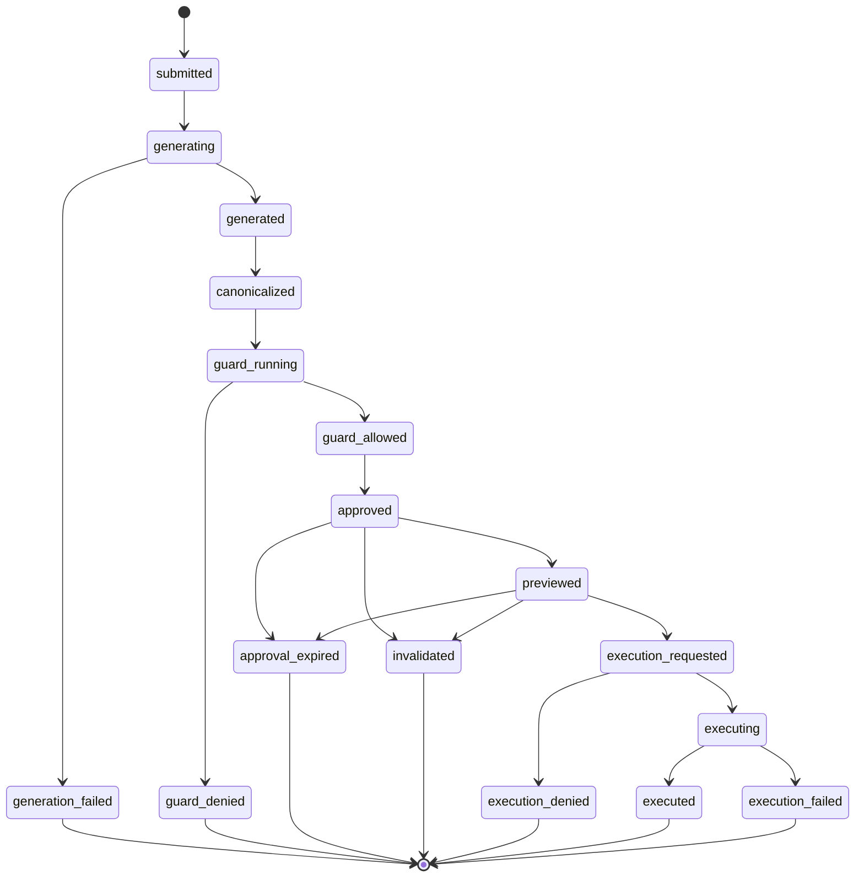

# Runtime Flow

## Purpose

This document describes the intended first-phase runtime flow for a SafeQuery request from authentication through execution and audit.

## End-to-End Flow

This document describes the SQL-backed answer path. Search-first and analyst-style interactions are described in [search-and-analyst-capabilities.md](./search-and-analyst-capabilities.md) and must still respect the same trust, guard, and audit constraints.

This SQL-backed path is the required Phase 1 core flow. Governed search, analyst composition, and MLflow tracing are optional feature-flagged extensions in Phase 1 and must not be treated as prerequisites for declaring the core SafeQuery control path implemented.

1. User authentication

   The user authenticates through the enterprise identity provider and SAML bridge. SafeQuery then establishes an application session and authorization context.

2. Query submission

   The authenticated user submits a natural language question through the custom web UI.

   Generate-path rate limits and concurrency checks apply before generation proceeds. If the request is rejected, the application records the rejection as an operational audit event.

3. Audit start

   The application records the incoming request and user identity in the application audit store.

   If MLflow is enabled, the application may also open an engineering trace for the request lifecycle.

4. SQL generation request

   The backend sends the request through the internal SQL generation adapter. The initial implementation may call a Vanna-based adapter backed by a local LLM runtime. The adapter receives curated schema context only and does not receive production SQL Server credentials.

5. Candidate SQL return

   The adapter returns candidate SQL to the application. This output is not yet trusted for execution.

6. Canonicalization and bounded-SQL preparation

   Before guard evaluation, the backend canonicalizes the candidate SQL and applies any required row-bounding rewrite for the Phase 1 bounded execution contract.

   The SQL that is hashed, guarded, previewed, and executed is the same canonical SQL.

7. SQL Guard evaluation

   The application validates candidate SQL using application-owned guardrails such as:

   - read-only enforcement
   - multi-statement rejection
   - object allow-list checks
   - cross-database and linked-server denial
   - execution limit checks

   Guard evaluation runs against the canonicalized candidate SQL prepared in the previous step.

8. Candidate persistence

   The backend computes a SQL hash for the canonical SQL, stores an opaque `query_candidate_id`, and records candidate ownership and validity metadata including owner subject, authorization snapshot, guard version, schema snapshot version, approval timestamp, approval expiration timestamp, replay limits, and invalidation fields.

   In the baseline lifecycle, this persistence step creates the approved execution-eligible candidate. Preview happens after approval metadata is already fixed.

9. Preview response

   The application returns the candidate SQL and guard outcome to the frontend so the user can inspect them. In Phase 1, the preview is read-only and not editable in place.

   The previewed SQL is the executable bounded canonical SQL. If row-bounding rewrites are used, they occur before preview and are included in the canonical SQL and hash. Browser-facing result and preview responses should use `no-store` or equivalent cache prevention. Export or download is disabled by default in Phase 1.

   Admin and audit interfaces should default to metadata-first display and must not re-expose full result payloads unless an explicit lower-level design authorizes that behavior.

10. Explicit execution request

   If the approved candidate remains visible and unexpired, the user may explicitly trigger execution through the UI. The execution request submits the `query_candidate_id`, not raw SQL text. No silent automatic execution is assumed in the first PoC.

   Execute-path rate limits and concurrency checks are applied separately from generate-path limits.

11. Controlled SQL execution

   The backend verifies that the candidate is already approved, unexpired, non-invalidated, owned by the current authenticated subject, still allowed under current authorization policy, and still below replay limits.

   The transition that claims execution rights is atomic: the backend must move the candidate into executable ownership for that request and increment `execution_count` in one database transaction or equivalent conditional update so that only one request can win the single-use claim.

   Only the request that successfully claims execution rights may continue to execute the stored canonical SQL through a dedicated read-only application login against Microsoft SQL Server.

   If allow-list state, schema snapshot policy, guard rules, role mapping, or kill-switch posture changed since approval, the backend denies execution or requires explicit revalidation rather than trusting stale approval state.

12. Result delivery

    The backend returns bounded results and metadata to the frontend for display. Phase 1 result handling applies row, byte, timeout, and cancellation controls.

13. Final audit persistence

    The application records guard decisions, execution decisions, execution metadata, and any error or denial outcome in PostgreSQL.

    If MLflow is enabled, the application may also finalize trace spans and evaluation metadata for engineering analysis. That export does not replace the authoritative application audit trail.

## Failure Paths

- If authentication fails, the request is rejected before query handling begins.
- If SQL generation fails, the application records the error and returns a controlled failure response.
- If SQL Guard denies execution, the SQL is shown as blocked and must not be executed.
- If the client submits an expired or mismatched `query_candidate_id`, execution is denied.
- If the current authenticated subject does not match candidate ownership or current authorization no longer permits execution, execution is denied.
- If another request already claimed the candidate atomically, later requests are denied as replay or stale-claim attempts.
- If rate limits or concurrency limits are exceeded, the affected request is rejected and audited.
- If SQL execution fails after approval, the failure is recorded as part of the audit trail.

## Key Design Rules

- Generated SQL is not trusted until the application validates it.
- Canonicalization and any required row-bounding rewrite happen before guard evaluation.
- The execute path accepts `query_candidate_id`, not raw SQL text.
- Candidate ownership and current entitlement must be revalidated at execute time.
- Single-use execution is protected by an atomic claim step before execution begins.
- Previewed SQL is read-only in Phase 1.
- Previewed SQL is the executable bounded canonical SQL in Phase 1.
- The normative state vocabulary lives in [query-lifecycle-state-machine.md](./query-lifecycle-state-machine.md).
- Execution authority always remains in the backend.
- End users do not connect directly to SQL Server.
- Audit logging occurs throughout the lifecycle, not only at the end.
- The runtime flow must still make sense if the SQL generation adapter is replaced later.

## Future Expansion Topics

Later design work may refine:

- retry behavior for generation failures
- admin and audit review workflows
