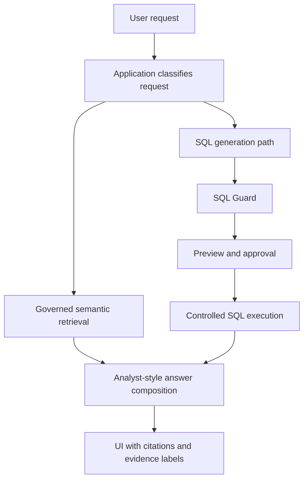

# Search and Analyst Capabilities

## Purpose

This document describes how SafeQuery can support features analogous to Snowflake Cortex Search and Analyst without moving trust, governance, or execution authority outside the application.

## Design Goal

SafeQuery should support two higher-level user experiences:

- a governed semantic search experience for discovering trusted business context
- an analyst-style experience that combines retrieval, SQL-backed evidence, and explanation

These capabilities should make the product more useful without turning it into an uncontrolled chat system.

## Phase 1 Posture

Governed search and analyst-style answer composition are optional Phase 1 extension tracks.

They are not required to declare the core SafeQuery NL2SQL control path implemented. If either extension is enabled in a Phase 1 deployment, the related governance, audit, evaluation, and authorization requirements become mandatory for that deployment.

## Capability 1: Governed Semantic Search

The search experience is analogous to Cortex Search in spirit, but inside the SafeQuery trust model.

The application may index approved semantic assets such as:

- business glossary content
- schema and column definitions
- metric definitions
- curated question and answer exemplars
- analytic playbooks and usage guidance

### Search Rules

- only approved assets may be indexed
- results must respect authorization and dataset governance
- results should include source attribution and version information
- search results are advisory knowledge, not execution authority

## Capability 2: Analyst-Style Answer Composition

The analyst experience is analogous to Cortex Analyst in spirit, but inside the SafeQuery trust model.

An analyst-style answer may combine:

- retrieved knowledge assets
- generated SQL candidates
- approved SQL execution results
- application-generated explanation and citations

### Analyst Rules

- analyst-style answers do not bypass SQL Guard
- analyst-style answers do not bypass preview-before-execute requirements
- generated narrative must distinguish between retrieved knowledge and executed result-backed evidence
- any SQL-backed claim must be traceable to a guarded and approved candidate

## Trust Boundary

The trust boundary remains unchanged:

- the application owns retrieval authorization
- the application owns SQL generation orchestration
- the application owns SQL Guard and execution control
- the application owns audit and evaluation

The retrieval layer and any explanation layer are advisory components inside the application architecture, not independent policy authorities.

If MLflow is enabled, it may observe these workflows and store evaluation runs, but it does not become an execution or authorization authority.

## High-Level Flow

## Output Types

The application should label analyst outputs clearly:

- knowledge citation: grounded in retrieved semantic assets
- SQL candidate: generated but not yet executed
- executed evidence: grounded in approved SQL execution results
- narrative guidance: explanatory text that does not itself grant execution authority

## Governance Implications

SafeQuery must govern not only datasets but also semantic assets used for search and analyst experiences.

That includes:

- which asset owner approves each indexed asset class or collection
- which security reviewer approves indexing posture, citation visibility, and sensitive-content exclusion
- which application maintainer applies approved corpus and authorization-scope changes
- who approves assets for indexing
- how assets are versioned
- how stale assets are invalidated
- how sensitive content is excluded from the retrieval corpus
- how retrieval visibility maps to application roles
- how explanation templates are versioned and withdrawn

## Retrieval and Analyst Sequence

When these capabilities are enabled, the baseline sequence is:

1. the application classifies whether the request is search-first, SQL-first, or mixed analyst mode
2. retrieval authorization is checked before any semantic assets are queried
3. retrieval returns asset identifiers, versions, and citation metadata
4. analyst composition may combine retrieved context with generated SQL and approved executed evidence
5. the rendered answer labels knowledge citations, SQL candidates, executed evidence, and narrative guidance as separate output classes
6. the application audits which assets, modes, and evidence classes were shown to the user

## Audit and Evaluation

If these capabilities are enabled, the application must audit:

- retrieval mode or analyst mode selection
- retrieval corpus version
- retrieved asset identifiers
- analyst or explanation mode version
- citations rendered to the user

Evaluation must also cover:

- retrieval relevance
- citation correctness
- explanation groundedness
- consistency between executed evidence and analyst narrative

MLflow is the recommended engineering backend for storing those traces and evaluation runs, while SafeQuery remains responsible for authoritative audit retention and release-gating interpretation.

## Non-Goals

These capabilities do not imply:

- autonomous execution without preview and approval
- unrestricted semantic search over all enterprise content
- replacing dataset governance with retrieval prompts
- treating analyst narrative as authoritative without citations or evidence
