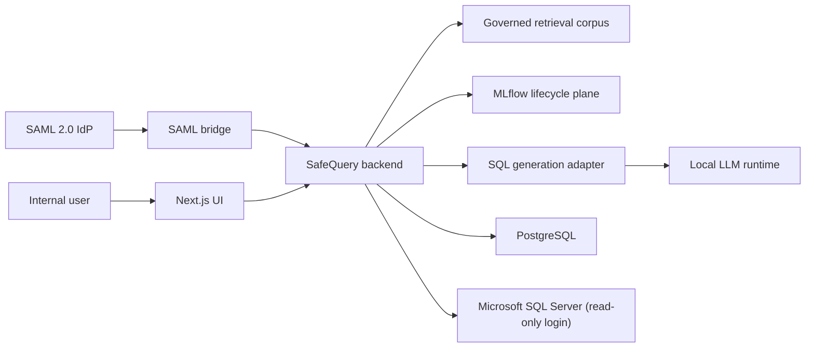

# System Context

## Purpose

This document describes the high-level system context for SafeQuery and identifies the main trust boundaries around the application.

## Primary Actors

- Internal business user
- Enterprise identity provider
- SAML bridge
- SafeQuery application
- Governed retrieval corpus
- MLflow lifecycle plane
- Local LLM runtime
- SQL generation adapter
- PostgreSQL
- Microsoft SQL Server

## Context Overview

SafeQuery sits between authenticated internal users and a constrained business dataset hosted on Microsoft SQL Server.

The application is the trusted control plane. It accepts user intent, orchestrates SQL generation through a replaceable adapter, evaluates generated SQL through application-owned guardrails, and executes only approved read-only queries.

The same application boundary may also provide:

- governed semantic search across approved knowledge assets
- analyst-style answer composition grounded in retrieval and approved SQL execution
- MLflow-backed engineering traces and evaluations for ML and LLM features

## Trust Boundary

The trusted application boundary includes:

- authentication integration consumption
- session handling
- authorization
- governed retrieval authorization and citation rendering
- SQL Guard
- execution approval
- SQL execution control
- audit persistence

The following are outside the trusted control boundary:

- the enterprise identity provider itself
- the SAML bridge implementation
- the SQL generation engine internals
- the local LLM runtime internals
- the MLflow service itself as an engineering support system

These external components may be necessary collaborators, but they do not own SafeQuery governance decisions.

## External Dependencies

### Enterprise identity path

The identity flow is:

Enterprise identity provider -> SAML bridge -> SafeQuery

The application trusts identity assertions through the bridge integration boundary but still owns product-specific authorization and session behavior.

### SQL generation path

SafeQuery sends natural language context to a replaceable SQL generation adapter. The initial adapter uses Vanna and a local LLM runtime.

Generated SQL is treated as untrusted candidate output until the application guard evaluates it.

The adapter receives curated schema and policy context from the application. It does not receive production SQL Server credentials and does not independently execute against the business database.

### Governed retrieval and analyst path

SafeQuery may index approved semantic assets such as glossary entries, schema definitions, metric descriptions, curated playbooks, and example analyses.

Retrieved assets are advisory context owned by the application. They may guide users or analyst-style answer composition, but they do not carry independent execution authority.

### ML lifecycle and observability path

SafeQuery may emit engineering traces, evaluation runs, and model lineage information to MLflow for debugging and quality management.

MLflow supports engineering visibility, not execution authority. SafeQuery remains authoritative for candidate lifecycle, guard, authorization, audit, and SQL execution control.

### Data access path

SafeQuery executes approved SQL using a dedicated read-only application login against a constrained Microsoft SQL Server dataset.

The execution path is owned by the backend only and must be driven by stored approved candidates rather than raw SQL submitted at execution time.

## Scope of the First PoC

The first PoC assumes:

- one SQL Server database
- a narrow allow-listed dataset
- a small internal pilot group
- no write access
- explicit user review before execution

## Key Architectural Message

SafeQuery is not an engine-centric chat interface. It is an application-owned control plane around a replaceable NL2SQL capability.
